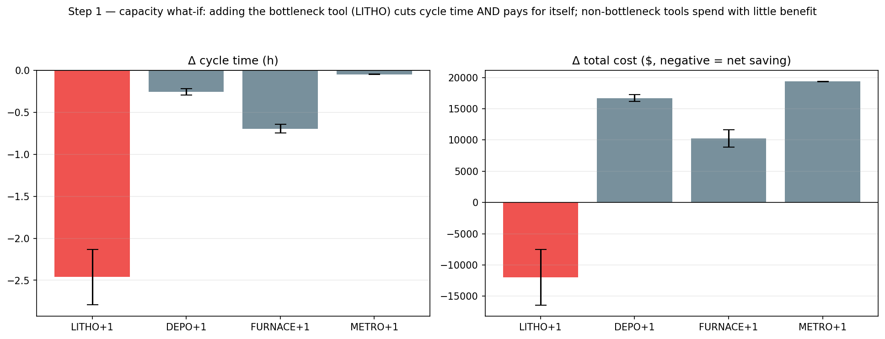

# Manufacturing Operations Analytics & Decision Support

**Quality-aware fab operations analytics with simulation-in-the-loop
decision support.**

Production data tells you what happened. This project turns it into **what to
do**: which station is the real constraint (with proof), when a KPI is drifting
out of control (with measured detection quality), and what a capacity, demand,
or policy change would do to cycle time, throughput, and cost, before spending
the money. The roadmap extends the same discipline to the questions a fab
actually weighs those answers against: yield risk, equipment health, and
dispatching policy.

**[▶ Interactive report & findings evidence](https://leonlaiyc.github.io/manufacturing-ops-analytics/)** ·
built on a validated discrete-event model of a fab-style line
(batch furnace, re-entrant litho bottleneck), plus process mining on a real
production log.

## Why fab operations, why now

Two realities of 2026 shape this iteration:

- **The binding constraint on AI hardware is packaging capacity, not wafer
  starts.** The industry's bottleneck conversation has moved to advanced
  packaging (CoWoS-class flows, HBM stacking), where batch tools, re-entrant
  routes, and queue-time limits decide throughput. Those are exactly the
  structures this project models and the toolkit (Theory of Constraints, slot
  utilization, paired counterfactuals) it validates at small scale.
- **Fabs are wiring simulators into agentic decision loops.** Samsung's GTC
  2026 talk with NVIDIA and Synopsys describes orchestrator and specialist
  agents that call a fab digital twin to test scenarios before acting on the
  real line. This project implements the simulation-in-the-loop decision core
  of that pattern: a validated what-if engine an agent can call, with every
  recommendation traceable to a logged simulation run. What a production
  digital twin adds on top (a live MES link, physical equipment) is exactly
  what this project does not claim.

How the pieces map onto the agentic-fab pattern shown at GTC 2026:

| Agentic-fab component (Samsung, GTC 2026) | This project | Status |
|---|---|---|
| Fab digital twin synced to MES | Validated DES of a fab-style line (synthetic, no live link) | shipped |
| Anomaly-watching agent (interlock manager) | EWMA / control-chart monitoring with measured detection quality | shipped |
| Diagnostic agent | CRN-paired bottleneck proof; equipment-health module planned | shipped + M8 |
| PM guide agent recommending maintenance strategy | Maintenance-timing trade-off | M8 (planned) |
| Scheduling and dispatching decisions | Dispatching-policy comparison | M9 (planned) |
| Orchestrator calling specialist analyses | Agent layer that calls the what-if simulator as a tool | M10 (planned) |
| Robot logistics (AMR / humanoid) | Out of scope: physical equipment | not claimed |

On the L2 to L5 autonomy ladder Synopsys presented in the same talk, the
planned agent layer is deliberately task-level (L2 to L3): it runs and
interprets simulations and drafts decision memos; it does not act autonomously.

## Three findings that matter

**1. Local bottleneck signals need system proof.**
The slowest per-run station and raw local signals can point to the wrong
candidate. Slot utilization and paired what-if tests converge on LITHO as the
effective constraint. Adding one litho tool cuts mean cycle time by **2.46 h
(95% CI 2.13-2.79)**; adding one furnace tool adds four lot-processing slots but
buys only **0.70 h**, all of it batching-delay relief, and recovers only about
half its cost.



**2. A KPI improvement is not a business case.** The cost model is illustrative:
it ranks options under explicit assumptions, not real factory quotes or a
financial forecast. In the equal-tool-cost base case, LITHO wins both filters:
largest average cycle-time reduction and the only negative net cost (about
-$12k). In an investment-stress scenario with station-specific tool costs
(LITHO $40k, FURNACE $8k, DEPO $5k, METRO $2k), LITHO still has the largest
operational impact but becomes about +$8.0k, while FURNACE becomes the best
financial result (about -$1.7k) with a smaller cycle-time gain. The right
recommendation therefore depends on the business objective: lead-time / WIP
reduction, delivery commitment, financial return, or a minimum improvement
threshold ([notebook 06](notebooks/06_capacity_demand_cost_whatif.ipynb)).

**3. Slow equipment drift is expensive and catchable.** A gentle bottleneck
degradation (an OEE Performance loss) barely touches output at first, but it
raises cycle time and congestion cost. [Notebook 05](notebooks/05_kpi_anomaly_monitoring.ipynb)
validates the EWMA monitoring method with labeled anomalies and clean
pre-anomaly baselines. [Notebook 06](notebooks/06_capacity_demand_cost_whatif.ipynb)
uses a 160-day synthetic backtest: LITHO starts degrading on day 30, an
output-only throughput monitor gives no alert within the horizon, and EWMA on
daily median lot cycle time alerts on day 84. The same scenario translates alert
timing into avoidable cost: about $249k total extra cost in the reference run,
with about 95% still avoidable after the EWMA alert. This is a backtested
synthetic scenario, not a real-world guarantee that every drift will be caught
on the same day.

## What's inside (shipped)

| Stage | What it does | Where |
|---|---|---|
| M1 Process mining | Reconstructs the actual flow of a **real** production log: DFG, cycle time, waiting-time decomposition, rework/variant analysis | [notebook 01](notebooks/01_process_mining_real_log.ipynb) |
| M2 Fab-style simulator | Transparent hand-built DES: batch furnace, re-entrant litho, engineered ground-truth bottleneck; validated via Little's Law (gap 0.2%) | [notebook 02](notebooks/02_synthetic_generator_demo.ipynb), `src/generator` |
| M3 KPI baseline | Shared baseline signals for the three findings: output, WIP, slot utilization, cycle time, **X-factor**; static + [interactive](https://leonlaiyc.github.io/manufacturing-ops-analytics/baseline.html) | [notebook 03](notebooks/03_kpi_dashboard.ipynb) |
| M4 Bottleneck proof | Multi-evidence convergence + naive-baseline refutation + **CRN paired counterfactual**; then applied to the real log with stated limits | [notebook 04](notebooks/04_bottleneck_identification.ipynb) |
| M5 Anomaly monitoring | Injected, labeled OEE-style anomalies (Availability / Performance losses); control chart + EWMA scored on delay, FAR, precision/recall | [notebook 05](notebooks/05_kpi_anomaly_monitoring.ipynb) |
| M6 Decision support | Capacity / demand / degradation what-ifs with a transparent cost model; improvement ranking under ±50% sensitivity | [notebook 06](notebooks/06_capacity_demand_cost_whatif.ipynb) |
| M7 Quality / yield layer | Post-litho queue-time windows, transparent lot-level yield model with known ground truth, virtual metrology (hand-built OLS), chamber matching, yield-aware CRN what-ifs | [notebook 07](notebooks/07_quality_yield_virtual_metrology.ipynb), `src/quality` |
| M8 Equipment health | SEMI E10-style tool states, MTBF / MTTR / availability, CRN-paired PM-timing trade-off, alert priority validated against simulated cost, GB+SHAP health model scored against known ground truth vs an EWMA baseline | [notebook 08](notebooks/08_equipment_health_e10_monitoring.ipynb), `src/equipment` |

## Roadmap (planned, in build order)

Each module states the outcome it must deliver before it counts as done.
Everything below is planned, not yet built; this table is the contract.

| Module | What it adds | Expected outcome | Status |
|---|---|---|---|
| M9 Dispatching policies | FIFO vs EDD vs critical ratio vs queue-time-aware vs bottleneck-WIP control, compared with CRN-paired runs on identical arrivals | A decision table stating which policy wins under which demand and yield-risk conditions, with confidence intervals | Planned |
| M10 Agentic decision support | An LLM agent that calls the what-if simulator as a tool and drafts decision memos | Ask an operational question in natural language; get a memo where every number traces to a logged simulation run | Planned |
| M11 Data quality & model reliability | Event schema contract, leakage-safe joins, drift monitoring, conformal uncertainty | Every model ships with its stated trust boundary: when to believe it and when not to | Planned |

A stylized advanced-packaging (HBM-class) back-end line is under consideration
as a follow-on scenario; it reuses the same DES engine but changes the locked
line design, so it is an explicit owner decision, not part of this roadmap yet.

## The line

A stylized single-layer wafer-fab loop; the unit of flow is a lot
(25-wafer FOUP):

```
CLEAN → FURNACE → DEPO → LITHO → ETCH → LITHO → IMPLANT → METRO
         (batch:            ↑ engineered bottleneck,
       2 tools × 4 lots)      re-entrant, slot ρ ≈ 0.85
```

The two defining fab structures are both present: **re-entrance** (litho visited
per layer) and **batch processing** (furnace runs carry 4 lots, which is why
"slowest per operation" misidentifies it as the constraint, and why capacity is
measured in **slot utilization**, not busy time).

## Methods are deliberately interpretable

Bottleneck logic is queueing / Theory-of-Constraints evidence, with no weighted
composite scores. Monitoring is control-chart / EWMA with baselines fit only on
clean pre-anomaly data. Cost is three transparent components used to **rank**
options under explicit assumptions, never to predict absolute dollars. The M6
stress scenario also tests station-specific added-tool costs, so operational and
financial rankings can point in different directions. When they do, the business
objective decides; sensitivity checks make the assumption boundary visible.
These choices are on purpose: operations decisions have to be explainable to,
and challengeable by, the people who act on them.

The same discipline applies to validation: methods are first proven on the
synthetic line, where the answer is known by construction (engineered
bottleneck, labeled anomaly windows, CRN-paired clean twins), and only then
applied to real data with the unprovable parts stated as limits. Where the
roadmap introduces machine learning (M8), it is held to the same standard: scored
against known ground truth, explained via SHAP, and never presented as
predictive power it has not demonstrated.

## Stack

Python (Jupyter) · pandas / numpy / scipy · matplotlib + plotly ·
hand-built discrete-event simulation and process-mining logic (no black-box
dependencies; every number is traceable to a raw log row or a documented
model assumption).

## Repository structure

```
manufacturing-ops-analytics/
├── data/
│   ├── raw/          # real production log (downloaded locally, gitignored)
│   ├── synthetic/    # generated synthetic event log + ground-truth metadata
│   └── README.md     # data provenance + honest-scope note
├── src/
│   ├── generator/    # fab-style DES (batch tool, re-entrant route, CRN)
│   ├── kpi/          # KPI computation + interactive dashboard export
│   ├── bottleneck/   # evidence signals, naive baselines, CRN counterfactual
│   ├── monitoring/   # anomaly injection, detectors, detection-quality scoring
│   └── decision/     # cost model + capacity/demand/degradation what-ifs
├── notebooks/        # one notebook per analysis stage (01-06)
├── docs/             # glossary + GitHub Pages (interactive dashboard)
└── reports/          # exported figures + standalone HTML dashboard
```

## Reproducibility

All synthetic data is generated from fixed seeds. Regenerate and re-validate:

```bash
python src/generator/validate_m2.py      # Little's Law + bottleneck recovery
python src/generator/crn_check.py        # CRN determinism gates (exact zero delta)
python src/monitoring/monitoring_check.py # anomaly-injection regression gates
python src/quality/quality_check.py      # yield-layer ground-truth gates
python src/quality/vm_check.py           # virtual metrology + pairing gates
python src/equipment/equipment_check.py  # E10 state-partition + RAM gates
python src/equipment/maintenance_check.py # PM-timing pairing + priority gates
python src/equipment/pdm_check.py        # sensor/GB+SHAP detection-quality gates
python src/kpi/export_html_dashboard.py  # rebuild the interactive dashboard
```

## Scope & honest notes

- The real production log (a job-shop machining process from the 4TU research
  repository) is used for **diagnosis only**; it has no tool counts or arrival
  model, so utilization, counterfactuals, and cost are computed only where they
  are defensible, and the notebooks say so explicitly where they are not.
- The synthetic line is **clearly labeled synthetic** throughout. It exists to
  give the methods a known ground truth (engineered bottleneck, labeled
  anomalies) so they can be **measured**, not just demonstrated. It is not a
  model of any specific factory.
- This project is not a digital twin. A digital twin, by the industry's own
  definition (including Samsung's GTC 2026 framing), maintains a live data
  connection to a physical fab and its MES. This project is the simulation and
  decision layer such an architecture calls into; the live link is stated as
  the boundary, not blurred.
- What is borrowed from the public **SMT2020** semiconductor testbed is the
  structural idea (re-entrant flow and batch tools), not its tool sets,
  routes, or process-time distributions.
- Cost rates and station-specific tool costs are illustrative; every cost
  conclusion is a **ranking** under explicit assumptions, tested for sensitivity,
  never a dollar forecast.
- Where AI assistance was used for implementation, the modeling assumptions and
  method choices are documented so they can be explained and challenged.
